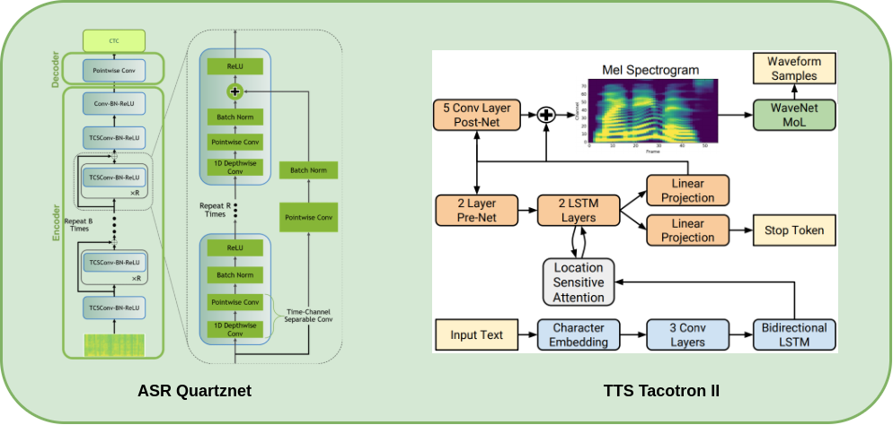

# PEER DJANGO-API


A django based REST API for serving ASR & TTS systems relating to Peer app
* This is the first version relased. 
* A later version implementing TorchServe will be soon pushed.

## Installation
* Clone this repository:
```
git clone https://github.com/aymanehachcham/Conversational-API.git
```
* Set up the virtual environment and all required dependencies either by:
1. Using [Anaconda](https://docs.anaconda.com/anaconda/install/):
```
conda env create -f peer_environment.yaml
```
2. Manually using pip:
* Set up a `python=3.6` virtual environment
* run: `pip install -r requirements.txt`

### Download required Checkpoints and config files from Google Drive:
* Google Drive link: [Conversational-API](https://drive.google.com/drive/u/3/folders/1ij8uSQSUu0nnOFKdoTsd9Aw65aBb55PY):
* Folder tree:
    * Bert_Checkpoints -> inside *ASR/Bert_NLP*
    * Parallel_Wavegan -> inside *ASR/TTS_ESPnet*
    * Quartznet_Checkpoints -> inside *ASR/Quartznet_ASR*
    * TTS_Checkpoints -> inside *ASR/TTS_ESPnet*
    
## Run the django API
`python manage.py runserver`
* The api will be automatically serving at localhost, port 8000 if you are in linux
 
